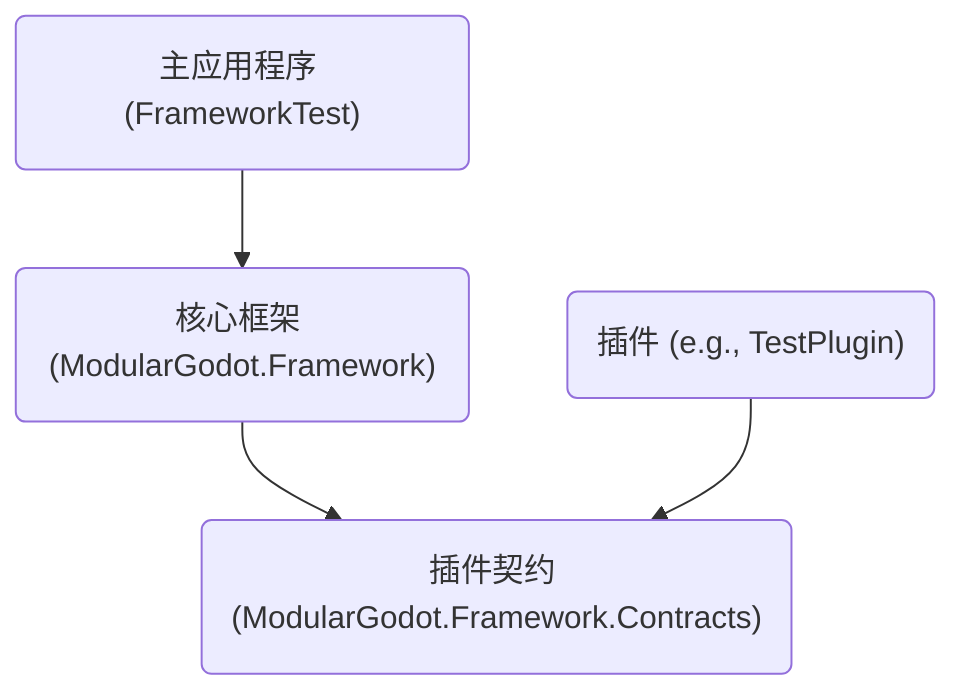

# 架构设计与开发规范

本文档旨在说明 ModularGodot.Framework (MF) 的核心设计理念、分层结构和开发规范。

## 核心思想：分离契约与实现

框架通过依赖注入和面向接口编程，实现了高度的模块化和可扩展性。其核心在于：

- **契约 (Contracts/Abstractions)**: 定义“能做什么”，以接口形式存在。
- **实现 (Implementation)**: 定义“如何做”，是接口的具体实现类。

主程序依赖契约，而插件或框架模块提供实现，在启动时由 `MF.Contexts` 自动扫描并注入。

## 框架分发：SDK模式

为了保证框架的稳定性和促进规范开发，整个 `ModularGodot.Framework/Core` 目录下的所有项目共同构成了一个 **“框架SDK”**。

当进行具体业务（如游戏功能）开发时，开发者**不应该**直接修改框架SDK内的任何项目源码。相反，应该将这些SDK项目编译为一系列 **DLLs**，并在自己的业务项目中**引用**这些DLL。

### SDK构成 (应编译为DLL的项目)

- **核心层 (`0_Base`)**:
    - `MF.Commons`: 通用工具和基类。
    - `MF.Contexts`: 依赖注入容器、插件加载器和应用生命周期管理。
    - `MF.Contracts`: **最重要的部分**，定义了所有模块和插件必须遵守的顶级接口（契约）。

- **基础设施层 (`1_2_Backend`)**:
    - `MF.Infrastructure.Abstractions`: 定义基础设施（如日志、缓存、事件总线）的接口。
    - `MF.Infrastructure`: 提供上述接口的默认实现。
    - `MF.Repositories.Abstractions`: 定义仓储模式（如`IRepository<T>`）的接口。
    - `MF.Repositories`: 提供仓储模式的通用基类实现，简化数据访问代码。

- **应用层 (`2_App`)**:
    - `MF.Services.Abstractions`: 定义业务逻辑服务的接口。
    - `MF.Services`: 提供通用的服务基类或框架内置的常见服务。
    - `MF.CQRS` / `MF.Events`: 提供命令查询职责分离（CQRS）和事件驱动架构的总线、基类等核心支持。

### 开发者工作流

1.  **获取框架SDK**: 编译 `ModularGodot.Framework` 下的所有项目，得到一套DLLs。
2.  **创建业务项目**: 在解决方案中创建新的项目，如 `MyGame.Features`, `MyGame.Services` 等。
3.  **引用SDK**: 在新的业务项目中，添加对所需框架DLL的引用（例如，`MyGame.Services` 引用 `MF.Services.Abstractions.dll` 和 `MF.Commons.dll`）。
4.  **实现业务逻辑**: 在 `MyGame.Services` 中创建新的服务类，实现 `MF.Services.Abstractions` 中定义的接口。
5.  **运行**: 主程序启动时，`MF.Contexts` 会自动发现并注册 `MyGame.Services` 中的新服务实现，使其在整个应用中可用。

这种模式确保了框架的**稳定性**和**一致性**，同时给予了业务开发**最大的灵活性**。

## 1. 项目引用规范

为了确保框架的松耦合、可维护性和可扩展性，所有项目必须遵循以下引用规范。核心原则是**依赖倒置**和**面向接口编程**。

### 1.1 核心设计原则

- **依赖倒置原则 (DIP):** 核心框架不应依赖于任何具体插件的实现。相反，框架和插件都应依赖于一个共享的、稳定的抽象层（`Contracts` 项目）。
- **关注点分离 (SoC):** 每个项目都有明确的职责。框架负责提供扩展机制，插件负责实现具体功能，主程序负责组装和启动。
- **插件化:** 插件之间应完全解耦。主程序通过动态加载来发现和集成它们，而不是在编译时硬编码引用。

### 1.2 项目角色与引用规则

#### 1.2.1 `ModularGodot.Framework.Contracts` (插件契约项目)

- **职责:** 定义所有插件需要实现的接口、共享的数据传输对象 (DTO)、枚举和事件。这是一个纯粹的“契约”程序集，只包含定义，不包含任何具体逻辑实现。
- **被谁引用:**
    - `ModularGodot.Framework` (核心框架)
    - 所有插件项目 (例如 `TestPlugin`)
- **禁止引用:**
    - **禁止**引用任何其他项目。它必须是项目依赖链的根基。

#### 1.2.2 `ModularGodot.Framework` (核心框架项目)

- **职责:** 提供框架的核心功能、插件加载机制 (`DependencyInjectionModule`)、基础服务和公共设施。
- **引用:**
    - `ModularGodot.Framework.Contracts` (为了识别和使用插件定义的接口)
- **禁止引用:**
    - **严禁**引用任何具体的插件项目。

#### 1.2.3 `Plugin Projects` (插件项目)

- **职责:** 实现一个或多个具体的功能模块，是业务逻辑的主要载体。
- **引用:**
    - `ModularGodot.Framework.Contracts` (为了实现“契约”中定义的接口)
- **禁止引用:**
    - **原则上禁止**直接引用 `ModularGodot.Framework`。如果需要框架的服务，应通过构造函数注入（DI）的方式在运行时获取，而不是通过项目引用。
    - **严禁**互相引用其他插件项目。插件间的通信必须通过共享接口或事件总线等间接方式完成。

#### 1.2.4 `FrameworkTest` (主应用程序)

- **职责:** 作为应用程序的入口点，负责配置和启动Godot引擎，并集成核心框架。
- **引用:**
    - `ModularGodot.Framework`
- **禁止引用:**
    - **严禁**引用任何具体的插件项目。插件是由框架在运行时动态加载的，主程序对此应保持无知。

### 1.3 引用关系图

