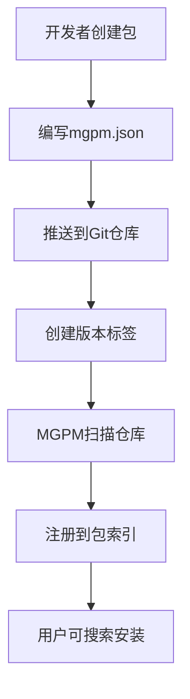
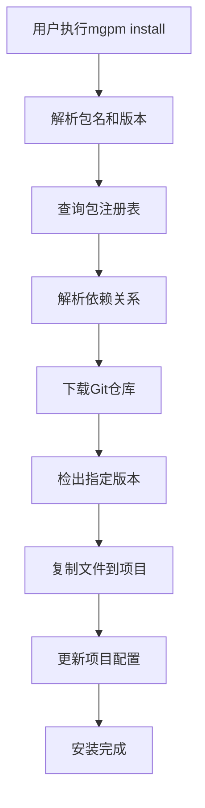

# MGPM独立项目架构设计

## 项目概述

**MGPM (ModularGodot Package Manager)** 是一个独立的源代码包管理工具，专为ModularGodot生态系统设计。作为独立项目，MGPM可以从Git仓库获取包信息并自动部署到目标项目中，提供现代化的包管理体验。

## 独立项目架构

### 项目结构
```
MGPM/                           # 独立MGPM项目根目录
├── src/
│   ├── MGPM.Core/              # 核心包管理引擎
│   │   ├── Models/             # 数据模型
│   │   ├── Services/           # 核心服务
│   │   ├── Interfaces/         # 抽象接口
│   │   └── Utils/              # 工具类
│   ├── MGPM.Git/               # Git操作模块
│   │   ├── Operations/         # Git操作封装
│   │   ├── Repository/         # 仓库管理
│   │   └── Sync/               # 同步机制
│   ├── MGPM.CLI/               # 命令行工具
│   │   ├── Commands/           # CLI命令
│   │   ├── Handlers/           # 命令处理器
│   │   └── Program.cs          # 入口点
│   ├── MGPM.Server/            # 包仓库服务器
│   │   ├── Controllers/        # API控制器
│   │   ├── Services/           # 业务服务
│   │   ├── Models/             # 数据模型
│   │   └── Data/               # 数据访问层
│   └── MGPM.Godot/             # Godot集成插件
│       ├── Editor/             # 编辑器插件
│       ├── Integration/        # 项目集成
│       └── UI/                 # 用户界面
├── tests/
│   ├── MGPM.Core.Tests/        # 核心模块测试
│   ├── MGPM.Git.Tests/         # Git模块测试
│   └── MGPM.CLI.Tests/         # CLI工具测试
├── docs/
│   ├── api/                    # API文档
│   ├── user-guide/             # 用户指南
│   └── developer-guide/        # 开发者指南
├── scripts/
│   ├── build.ps1               # 构建脚本
│   ├── deploy.ps1              # 部署脚本
│   └── test.ps1                # 测试脚本
├── docker/
│   ├── Dockerfile              # Docker镜像
│   └── docker-compose.yml      # 容器编排
├── .github/
│   └── workflows/              # GitHub Actions
├── mgpm.sln                    # 解决方案文件
└── README.md                   # 项目说明
```

## 核心架构设计

### 1. MGPM.Core - 核心引擎

#### 1.1 包管理核心
```csharp
// 包管理器接口
public interface IPackageManager
{
    Task<PackageInfo> GetPackageInfoAsync(string packageName, string version = null);
    Task<InstallResult> InstallPackageAsync(string packageName, string version, string targetPath);
    Task<UpdateResult> UpdatePackageAsync(string packageName, string targetPath);
    Task<UninstallResult> UninstallPackageAsync(string packageName, string targetPath);
}

// 依赖解析器
public interface IDependencyResolver
{
    Task<DependencyGraph> ResolveAsync(PackageRequest request);
    Task<ConflictResolution> ResolveConflictsAsync(IEnumerable<Conflict> conflicts);
}

// 版本管理器
public interface IVersionManager
{
    bool IsCompatible(VersionConstraint constraint, Version version);
    Version GetBestMatch(IEnumerable<Version> versions, VersionConstraint constraint);
    Task<IEnumerable<Version>> GetAvailableVersionsAsync(string packageName);
}
```

#### 1.2 数据模型
```csharp
// 包信息模型
public class PackageInfo
{
    public string Name { get; set; }
    public Version Version { get; set; }
    public string Description { get; set; }
    public string Author { get; set; }
    public string License { get; set; }
    public GitRepository Repository { get; set; }
    public Dictionary<string, VersionConstraint> Dependencies { get; set; }
    public PackageConfiguration Configuration { get; set; }
}

// Git仓库信息
public class GitRepository
{
    public string Url { get; set; }
    public string Branch { get; set; }
    public string Tag { get; set; }
    public string Commit { get; set; }
    public AuthenticationInfo Auth { get; set; }
}

// 包配置
public class PackageConfiguration
{
    public string[] SourcePaths { get; set; }
    public string[] AssetPaths { get; set; }
    public string[] ExcludePaths { get; set; }
    public Dictionary<string, object> ProjectSettings { get; set; }
    public string[] AutoLoadScripts { get; set; }
}
```

### 2. MGPM.Git - Git操作模块

#### 2.1 Git操作封装
```csharp
public interface IGitOperations
{
    Task<Repository> CloneAsync(string url, string localPath, CloneOptions options = null);
    Task<bool> PullAsync(Repository repository, string branch = null);
    Task<bool> CheckoutAsync(Repository repository, string commitish);
    Task<IEnumerable<Commit>> GetCommitsAsync(Repository repository, string since = null);
    Task<bool> HasChangesAsync(Repository repository, string path = null);
}

// Git仓库管理器
public interface IRepositoryManager
{
    Task<Repository> GetOrCloneRepositoryAsync(GitRepository gitRepo, string localPath);
    Task<bool> UpdateRepositoryAsync(Repository repository, string targetCommit);
    Task<string> GetLatestCommitAsync(Repository repository, string branch);
    Task<IEnumerable<string>> GetTagsAsync(Repository repository);
}
```

#### 2.2 同步机制
```csharp
public interface ISourceSynchronizer
{
    Task<SyncResult> SyncPackageAsync(PackageInfo package, string targetPath);
    Task<SyncResult> UpdatePackageAsync(PackageInfo package, string targetPath);
    Task<bool> RemovePackageAsync(string packageName, string targetPath);
}

public class SyncResult
{
    public bool Success { get; set; }
    public string[] AddedFiles { get; set; }
    public string[] ModifiedFiles { get; set; }
    public string[] RemovedFiles { get; set; }
    public string[] Conflicts { get; set; }
    public string ErrorMessage { get; set; }
}
```

### 3. MGPM.CLI - 命令行工具

#### 3.1 命令结构
```csharp
// 基础命令接口
public interface ICommand
{
    Task<int> ExecuteAsync(string[] args);
}

// 安装命令
[Command("install", Description = "Install a package")]
public class InstallCommand : ICommand
{
    [Argument(0, Description = "Package name")]
    public string PackageName { get; set; }
    
    [Option("-v|--version", Description = "Package version")]
    public string Version { get; set; }
    
    [Option("-p|--path", Description = "Target path")]
    public string TargetPath { get; set; } = ".";
    
    public async Task<int> ExecuteAsync(string[] args)
    {
        // 实现安装逻辑
    }
}
```

#### 3.2 核心CLI命令
```bash
# 包管理命令
mgpm install <package-name>[@version] [--path <target-path>]
mgpm update [package-name] [--path <target-path>]
mgpm uninstall <package-name> [--path <target-path>]
mgpm list [--path <target-path>]
mgpm search <query>

# 项目管理命令
mgpm init [--template <template-name>] [--path <target-path>]
mgpm restore [--path <target-path>]
mgpm clean [--path <target-path>]

# 包开发命令
mgpm pack [--output <output-path>]
mgpm publish [--registry <registry-url>]
mgpm validate [--path <package-path>]

# 仓库管理命令
mgpm registry add <name> <url>
mgpm registry remove <name>
mgpm registry list

# 诊断命令
mgpm doctor [--path <target-path>]
mgpm why <package-name> [--path <target-path>]
mgpm audit [--path <target-path>]
```

### 4. MGPM.Server - 包仓库服务

#### 4.1 API设计
```csharp
[ApiController]
[Route("api/[controller]")]
public class PackagesController : ControllerBase
{
    [HttpGet]
    public async Task<ActionResult<PagedResult<PackageInfo>>> GetPackages(
        [FromQuery] string query = null,
        [FromQuery] int page = 1,
        [FromQuery] int pageSize = 20)
    {
        // 获取包列表
    }
    
    [HttpGet("{name}")]
    public async Task<ActionResult<PackageInfo>> GetPackage(string name)
    {
        // 获取包信息
    }
    
    [HttpGet("{name}/versions")]
    public async Task<ActionResult<IEnumerable<Version>>> GetVersions(string name)
    {
        // 获取包版本列表
    }
    
    [HttpPost]
    [Authorize]
    public async Task<ActionResult> PublishPackage([FromBody] PublishRequest request)
    {
        // 发布包
    }
}
```

#### 4.2 包注册表
```csharp
public interface IPackageRegistry
{
    Task<PackageInfo> GetPackageAsync(string name, string version = null);
    Task<IEnumerable<PackageInfo>> SearchPackagesAsync(string query);
    Task<bool> RegisterPackageAsync(PackageInfo package);
    Task<bool> UpdatePackageAsync(PackageInfo package);
    Task<bool> DeletePackageAsync(string name, string version = null);
}

// 包存储接口
public interface IPackageStorage
{
    Task<Stream> GetPackageStreamAsync(string name, string version);
    Task<bool> StorePackageAsync(string name, string version, Stream content);
    Task<bool> DeletePackageAsync(string name, string version);
}
```

## Git仓库集成方案

### 1. 包发现机制

#### 1.1 仓库扫描
```csharp
public class GitPackageDiscovery
{
    public async Task<IEnumerable<PackageInfo>> DiscoverPackagesAsync(string repositoryUrl)
    {
        var repo = await _gitOperations.CloneAsync(repositoryUrl, tempPath);
        var packages = new List<PackageInfo>();
        
        // 扫描根目录的mgpm.json
        if (File.Exists(Path.Combine(repo.Info.WorkingDirectory, "mgpm.json")))
        {
            var package = await ParsePackageInfoAsync(repo.Info.WorkingDirectory);
            packages.Add(package);
        }
        
        // 扫描子目录
        foreach (var dir in Directory.GetDirectories(repo.Info.WorkingDirectory))
        {
            if (File.Exists(Path.Combine(dir, "mgpm.json")))
            {
                var package = await ParsePackageInfoAsync(dir);
                packages.Add(package);
            }
        }
        
        return packages;
    }
}
```

#### 1.2 包配置文件格式
```json
{
  "name": "ModularGodot.AudioSystem",
  "version": "1.0.0",
  "description": "Advanced audio system for ModularGodot",
  "author": "ModularGodot Team",
  "license": "MIT",
  "repository": {
    "type": "git",
    "url": "https://github.com/ModularGodot/AudioSystem.git",
    "branch": "main",
    "directory": "src/AudioSystem"
  },
  "dependencies": {
    "ModularGodot.Core": "^1.0.0",
    "ModularGodot.Events": "^1.1.0"
  },
  "sources": {
    "include": ["src/**/*.cs", "scripts/**/*.cs"],
    "exclude": ["**/*.Test.cs", "**/bin/**", "**/obj/**"]
  },
  "assets": {
    "include": ["assets/**/*", "scenes/**/*.tscn"],
    "exclude": ["**/*.tmp"]
  },
  "godot": {
    "version": ">=4.4.0",
    "autoLoad": {
      "AudioManager": "src/AutoLoad/AudioManager.cs"
    },
    "projectSettings": {
      "audio/driver/enable_input": true,
      "audio/buses/default_bus_layout": "res://audio_bus_layout.tres"
    },
    "inputMap": {
      "audio_toggle": {
        "events": ["InputEventKey:F10"]
      }
    }
  },
  "scripts": {
    "build": "dotnet build",
    "test": "dotnet test",
    "clean": "dotnet clean"
  },
  "keywords": ["audio", "sound", "music", "3d-audio"],
  "homepage": "https://modulargodot.org/packages/audio"
}
```

### 2. 部署机制

#### 2.1 智能部署策略
```csharp
public class PackageDeployer
{
    public async Task<DeployResult> DeployPackageAsync(PackageInfo package, string targetPath)
    {
        var result = new DeployResult();
        
        // 1. 克隆或更新源仓库
        var repo = await _repositoryManager.GetOrCloneRepositoryAsync(
            package.Repository, GetCachePath(package));
            
        // 2. 检出指定版本
        await _gitOperations.CheckoutAsync(repo, package.Version.ToString());
        
        // 3. 复制源代码文件
        await CopySourceFilesAsync(package, repo.Info.WorkingDirectory, targetPath);
        
        // 4. 复制资源文件
        await CopyAssetFilesAsync(package, repo.Info.WorkingDirectory, targetPath);
        
        // 5. 更新项目配置
        await UpdateProjectConfigurationAsync(package, targetPath);
        
        // 6. 配置Godot项目设置
        await ConfigureGodotProjectAsync(package, targetPath);
        
        return result;
    }
}
```

#### 2.2 项目集成
```csharp
public class GodotProjectIntegrator
{
    public async Task IntegratePackageAsync(PackageInfo package, string projectPath)
    {
        var projectFile = Path.Combine(projectPath, "project.godot");
        var config = new ConfigFile();
        config.Load(projectFile);
        
        // 配置AutoLoad
        if (package.Configuration.AutoLoadScripts?.Any() == true)
        {
            foreach (var autoLoad in package.Configuration.AutoLoadScripts)
            {
                var name = Path.GetFileNameWithoutExtension(autoLoad);
                var path = $"res://{autoLoad}";
                config.SetValue("autoload", name, path);
            }
        }
        
        // 配置项目设置
        if (package.Configuration.ProjectSettings?.Any() == true)
        {
            foreach (var setting in package.Configuration.ProjectSettings)
            {
                var section = setting.Key.Split('/')[0];
                var key = string.Join("/", setting.Key.Split('/').Skip(1));
                config.SetValue(section, key, setting.Value);
            }
        }
        
        config.Save(projectFile);
    }
}
```

## 独立部署架构

### 1. 分发策略

#### 1.1 多平台支持
```yaml
# GitHub Actions 构建配置
name: Build and Release

on:
  push:
    tags: ['v*']

jobs:
  build:
    strategy:
      matrix:
        os: [windows-latest, ubuntu-latest, macos-latest]
        
    runs-on: ${{ matrix.os }}
    
    steps:
    - uses: actions/checkout@v4
    
    - name: Setup .NET
      uses: actions/setup-dotnet@v4
      with:
        dotnet-version: '9.0.x'
        
    - name: Build CLI
      run: |
        dotnet publish src/MGPM.CLI/MGPM.CLI.csproj \
          -c Release \
          -r ${{ matrix.runtime }} \
          --self-contained true \
          -p:PublishSingleFile=true
          
    - name: Build Server
      run: |
        dotnet publish src/MGPM.Server/MGPM.Server.csproj \
          -c Release \
          -o ./publish/server
```

#### 1.2 安装脚本
```powershell
# Windows安装脚本 (install.ps1)
param(
    [string]$Version = "latest",
    [string]$InstallPath = "$env:LOCALAPPDATA\MGPM"
)

# 下载最新版本
$downloadUrl = "https://github.com/ModularGodot/MGPM/releases/download/$Version/mgpm-windows-x64.exe"
Invoke-WebRequest -Uri $downloadUrl -OutFile "$InstallPath\mgpm.exe"

# 添加到PATH
$currentPath = [Environment]::GetEnvironmentVariable("PATH", "User")
if ($currentPath -notlike "*$InstallPath*") {
    [Environment]::SetEnvironmentVariable("PATH", "$currentPath;$InstallPath", "User")
}

Write-Host "MGPM installed successfully!"
Write-Host "Run 'mgpm --version' to verify installation."
```

### 2. 配置管理

#### 2.1 全局配置
```json
// ~/.mgpm/config.json
{
  "registries": {
    "default": "https://packages.modulargodot.org",
    "local": "http://localhost:5000"
  },
  "cache": {
    "directory": "~/.mgpm/cache",
    "maxSize": "1GB",
    "ttl": "7d"
  },
  "git": {
    "defaultBranch": "main",
    "timeout": "30s",
    "credentials": {
      "github.com": {
        "type": "token",
        "value": "${GITHUB_TOKEN}"
      }
    }
  },
  "proxy": {
    "http": "http://proxy.company.com:8080",
    "https": "https://proxy.company.com:8080"
  }
}
```

#### 2.2 项目配置
```json
// project-root/mgpm.lock
{
  "version": "1.0",
  "packages": {
    "ModularGodot.AudioSystem": {
      "version": "1.2.0",
      "resolved": "https://github.com/ModularGodot/AudioSystem.git#v1.2.0",
      "integrity": "sha256-abc123...",
      "dependencies": {
        "ModularGodot.Core": "1.0.0",
        "ModularGodot.Events": "1.1.0"
      }
    }
  },
  "metadata": {
    "generated": "2024-12-28T10:30:00Z",
    "mgpmVersion": "1.0.0"
  }
}
```

## 开发和部署流程

### 1. 开发工作流



### 2. 安装流程



### 3. 持续集成

```yaml
# 包仓库的CI配置
name: Package CI

on:
  push:
    branches: [main]
  pull_request:
    branches: [main]

jobs:
  validate:
    runs-on: ubuntu-latest
    steps:
    - uses: actions/checkout@v4
    
    - name: Validate package
      run: |
        mgpm validate .
        
    - name: Test package
      run: |
        mgpm install . --path ./test-project
        cd test-project
        dotnet build
        dotnet test
        
  publish:
    if: startsWith(github.ref, 'refs/tags/v')
    needs: validate
    runs-on: ubuntu-latest
    steps:
    - name: Publish to registry
      run: |
        mgpm publish --registry https://packages.modulargodot.org
      env:
        MGPM_TOKEN: ${{ secrets.MGPM_TOKEN }}
```

## 性能和安全考虑

### 1. 性能优化

- **增量同步**: 只下载变更的文件
- **并行处理**: 并行下载和处理多个包
- **智能缓存**: 基于内容哈希的缓存策略
- **压缩传输**: 使用Git的压缩传输协议

### 2. 安全措施

- **包签名验证**: 使用GPG签名验证包完整性
- **依赖审计**: 检测已知安全漏洞
- **沙箱执行**: 隔离包的安装和执行环境
- **权限控制**: 细粒度的包访问权限管理

## 总结

通过将MGPM设计为独立项目，我们实现了：

1. **完全独立**: 不依赖ModularGodot.Framework，可独立开发和部署
2. **Git原生**: 直接从Git仓库获取包信息，无需中央包存储
3. **灵活部署**: 支持多种部署模式，从本地开发到企业级部署
4. **现代架构**: 采用微服务架构，支持水平扩展
5. **开发者友好**: 提供丰富的CLI命令和图形界面

这种独立架构使MGPM能够更好地服务于ModularGodot生态系统，同时保持足够的灵活性以适应不同的使用场景。